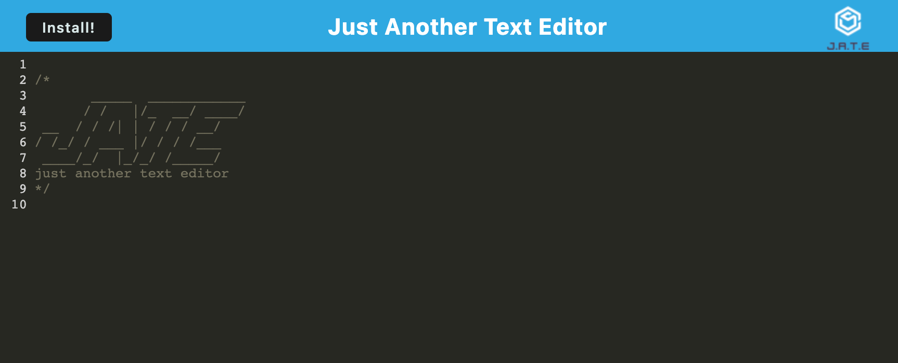

# yate-jate
      
## Description

JATE is a simple, browser-based text editor designed to provide a convenient and intuitive environment for writing and editing code. With support for syntax highlighting and a sleek interface, JATE is perfect for quick edits and programming on-the-go.

## Table of Contents

- [Installation](#installation)
- [Usage](#usage)
- [Credits](#credits)
- [License](#license)

## Installation

- [Project repo](https://github.com/shaynefw/yate-jate)
- [Project deployed link](https://yate-jate.herokuapp.com/)
- [Project Video Demo]()

1. Clone the repository: 
    ```bash
    git clone https://github.com/shaynefw/yate-jate.git
    ```

2. Navigate to the project directory:
    ```bash
    cd yate-jate
    ```

3. Install dependencies for both server and client:
    ```bash
    npm run install 
    ```
4. To run the app in development mode, use the following command:
    ```bash
    npm run start:dev
    ```
5. The app will be available at http://localhost:3001.

## Usage



## Credits

Credits to my professor, instructors, classmates, and tutors for their invaluable support and guidance throughout my learning journey. Also to the developers of the various technologies used, including Google, documentation resources, and AI technologies that have provided valuable assistance and inspiration.

## License

MIT License

Copyright (c) 2023 Shayne Whayne

Permission is hereby granted, free of charge, to any person obtaining a copy
of this software and associated documentation files (the "Software"), to deal
in the Software without restriction, including without limitation the rights
to use, copy, modify, merge, publish, distribute, sublicense, and/or sell
copies of the Software, and to permit persons to whom the Software is
furnished to do so, subject to the following conditions:

The above copyright notice and this permission notice shall be included in all
copies or substantial portions of the Software.

THE SOFTWARE IS PROVIDED "AS IS", WITHOUT WARRANTY OF ANY KIND, EXPRESS OR
IMPLIED, INCLUDING BUT NOT LIMITED TO THE WARRANTIES OF MERCHANTABILITY,
FITNESS FOR A PARTICULAR PURPOSE AND NONINFRINGEMENT. IN NO EVENT SHALL THE
AUTHORS OR COPYRIGHT HOLDERS BE LIABLE FOR ANY CLAIM, DAMAGES OR OTHER
LIABILITY, WHETHER IN AN ACTION OF CONTRACT, TORT OR OTHERWISE, ARISING FROM,
OUT OF OR IN CONNECTION WITH THE SOFTWARE OR THE USE OR OTHER DEALINGS IN THE
SOFTWARE.

## Badges


## Features

- Lightweight and fast
- Syntax highlighting for JavaScript
- Monokai theme for improved readability
- Line numbers and line wrapping
- Auto-save feature with localStorage and IndexedDB
- Progressive Web App (PWA) support for offline usage

## How to Contribute

## Tests

## Questions
  
If you have any questions you can reach me by...
  